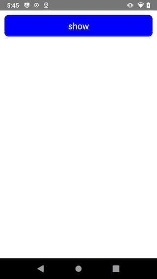

# react-native-bottom-modal

* Modal with bottom slide out animation
* Customizable content components
* Support Android and IOS

## Install

`$ yarn add react-native-bottom-modal`

or

`$ npm install react-native-bottom-modal --save`

## Import

`import {BottomModal} from 'react-native-bottom-modal'`

## Props

| Props             | Type                 | Desc                                                         | Default   |
| :---------------- | :------------------- | ------------------------------------------------------------ | --------- |
| containerStyle    | StyleProp<ViewStyle> | Sets view style of content root view.                        | undefined |
| hasMask           | boolean              | Sets whether show mask.                                      | true      |
| touchOutsideClose | boolean              | Sets whether touch outside the content to close this modal.  | true      |
| backKeyClose      | boolean              | Sets whether close this modal with android BACK key . [only Android] | true      |
| keyboardAvoid     | boolean              | Sets whether use KeyboardAvoidingView. [only IOS]            | false     |
| onShow            | function             | Sets the show callback.                                      | undefined |
| onDismiss         | function             | Sets the close callback.                                     | undefined |

## Methods

| Methods   | Desc                                      |
| --------- | ----------------------------------------- |
| show()    | use ref call this function to show modal  |
| dismiss() | use ref call this function to close modal |


## Example

```tsx
<Button 
  title="show Modal" 
  onPress={()=>{
    ref.current?.show()
  }}/>
<BottomModal
  ref={ref}
  containerStyle={{ height: 200 }}
  onShow={()=>{
    console.info("show======")
  }}
  onDismiss={() => {
    console.info("dismiss======")
  }}>
  <Text>Content</Text>
</BottomModal>
```


